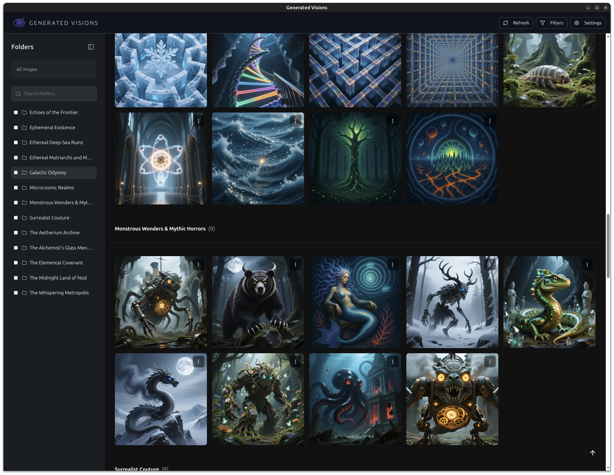

# Generated Visions

[](https://generated-visions-demo-915317959736.us-central1.run.app)
[](https://opensource.org/licenses/MIT)

*A beautiful, local-first gallery for all your AI-generated media.*



Are you an AI artist or enthusiast with a rapidly growing collection of generated images and videos? Tired of sifting through endless folders, struggling to remember which prompt created which masterpiece, or just wishing for a more inspiring way to view your work?

**Generated Visions** is the answer. It's a desktop application designed from the ground up to be your private, offline-first hub for managing, browsing, and enjoying your AI creations.

Go take a look at our [demo](https://generated-visions-demo-915317959736.us-central1.run.app).

## Key Features

-   ✨ **Beautiful & Immersive Gallery:** Browse your media in a clean, modern interface. View images and videos, and enter a distraction-free fullscreen mode to appreciate the details.
-   🗂️ **Seamless Folder Organization:**
    -   Import multiple root folders and switch between them with a single click.
    -   Your existing folder structure *is* your gallery. Media is automatically grouped by the folders they're in, just like on your file system.
-   🔒 **Local First & Private:** Your media and metadata never leave your machine. Generated Visions reads directly from your local folders, ensuring your work remains private.
-   🔍 **Powerful Filtering & Search:**
    -   **Star** your favorites for quick access.
    -   **Hide** the generations that didn't make the cut.
    -   Filter your view to see only starred, hidden, or regular items.
-   📝 **AI Metadata:** Keep track of what makes your creations unique. Save and view the **prompt**, **model**, and **LoRAs** used for each piece of media.
-   🖥️ **Cross-Platform:** A single, installable application for Windows, macOS, and Linux.

## Installation

For the best experience, download the latest release for your operating system.

### Linux (.deb)

1.  **Download the .deb package:**
    Head to the **[Releases](https://github.com/ostamand/generated-visions/releases)** page of this GitHub repository and download the latest `.deb` file (e.g., `generated-visions_0.1.0_amd64.deb`).
2.  **Install the package:**
    Open your terminal and navigate to the directory where you downloaded the `.deb` file. Then, run the following command:
    ```bash
    sudo apt install ./generated-visions_0.1.0_amd64.deb
    ```
3.  **Launch the application:**
    You can usually find "Generated Visions" in your applications menu, or launch it from the terminal:
    ```bash
    generated-visions
    ```

### macOS

1.  **Download the .dmg image:**
    Go to the **[Releases](https://github.com/ostamand/generated-visions/releases)** page and download the latest `.dmg` file.
2.  **Install the application:**
    Open the `.dmg` file and drag the **Generated Visions** icon to your **Applications** folder.
3.  **Open the application (Important):**
    Since this app is currently unsigned, macOS will prevent it from opening by default to protect your system.
    *   **Right-click (or Control-click)** the Generated Visions app in your Applications folder.
    *   Select **Open** from the context menu.
    *   A dialog will appear saying it is from an unidentified developer. Click **Open** again to launch it.
    *   *Note: You only need to do this the first time you run the app.*

    **If you see "App is damaged and can't be opened":**
    This is a common macOS security message for unsigned apps downloaded from the internet. To fix this:
    1.  Open **Terminal**.
    2.  Run the following command:
        ```bash
        sudo xattr -cr /Applications/Generated\ Visions.app
        ```
    3.  Launch the app again.

### Windows

1.  **Download the installer:**
    Go to the **[Releases](https://github.com/ostamand/generated-visions/releases)** page and download the latest `.exe` file.
2.  **Run the installer:**
    Double-click the `.exe` file to start installation.
3.  **Bypass SmartScreen (Important):**
    You may see a blue window saying "Windows protected your PC" because the app is unsigned.
    *   Click **More info**.
    *   Click the **Run anyway** button that appears at the bottom.

## For Developers

See [DEVELOPMENT.md](DEVELOPMENT.md).